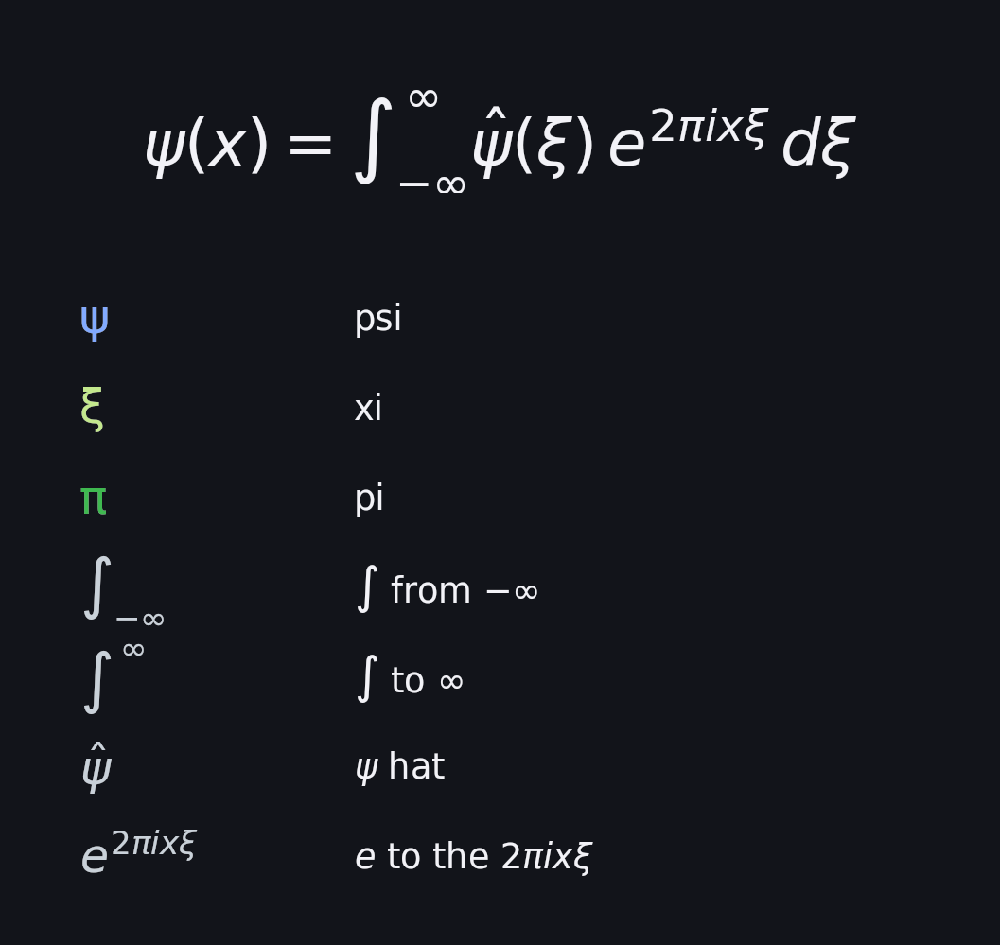

<p align="center">
  
</p>

<h1 align="center">mathcat</h1>

<p align="center">
  One math formula, drawn as a PNG.<br>
  macOS and Ubuntu. No TeX install.
</p>

## Install

Python 3.10 or newer.

```bash
python3 -m pip install matplotlib
python3 -m pip install git+https://github.com/johndpope/mathcat.git
mathcat 'e^{i\pi}+1=0'
```

`mathcat` lands on your `PATH`, usually at `~/.local/bin`. On iTerm2, pipe it if you want the picture inline:

```bash
mathcat 'e^{i\pi}+1=0' | imgcat
```

<p align="center">
  
</p>

```bash
mathcat --legend '\psi(x)=\int_{-\infty}^{\infty}\hat{\psi}(\xi)\,e^{2\pi i x \xi}\,d\xi'
```

<p align="center">
  
</p>

## For an LLM

Do not invent a workflow from this page. Load the mathcat skill and follow it.

- Grok: [`.grok/skills/mathcat/SKILL.md`](.grok/skills/mathcat/SKILL.md)
- Claude: [`.claude/skills/mathcat/SKILL.md`](.claude/skills/mathcat/SKILL.md)

They are the same file. Install both so a chat in either tool can run it:

```bash
mkdir -p ~/.grok/skills ~/.claude/skills
ln -sfn /path/to/mathcat/.grok/skills/mathcat ~/.grok/skills/mathcat
ln -sfn /path/to/mathcat/.grok/skills/mathcat ~/.claude/skills/mathcat
```

`/mathcat` runs it. Asking to see a formula selects it.

People who want the flags, the ledger for Greek, accents, and scripts, and the pictures: [USAGE.md](USAGE.md).

## License

Copyright 2026 John D. Pope.

[Do No Harm License](LICENSE.md) (pre 1.0), the license at [raisely/NoHarm](https://github.com/raisely/NoHarm/blob/publish/LICENSE.md).
